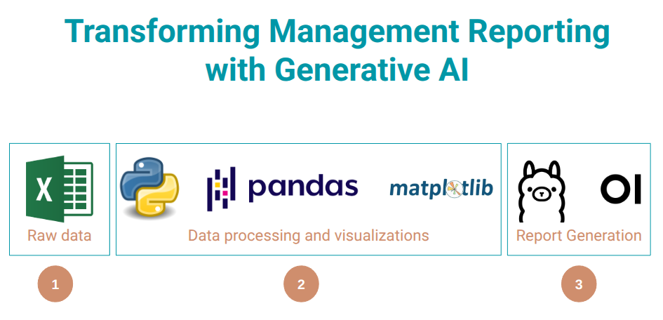

# Transforming Management Reporting with Generative AI (LLM)

## 1. Objective

This project is a proof-of-concept demonstrating how to combine data analysis techniques with Large Language Models (LLMs) to automatically generate management reports from raw financial data stored in Excel format. 

The goal is to streamline the report generation process, providing data-driven insights with AI-generated summaries and visualizations, a life changer for accounting and finance professionals. Watch [demonstration video](https://www.youtube.com/watch?v=4qEi_lSWkG4) here.

## 2. Setup and Installation

### Prerequisites

*   **Python+**
*   **pipx package manager**
*   **Ollama**
*   **open-webui**

### Installation Steps

1.  **Clone the Repository:**

    ```bash
    git clone https://github.com/voidbydefault/LLM_Financial_Report_Generator.git
    cd LLM_Financial_Report_Generator
    ```

2.  **Create and Activate a Virtual Environment (Recommended):**

    ```bash
    python3 -m venv .venv
    source .venv/bin/activate  # On Linux/macOS
    .venv\Scripts\activate   # On Windows
    ```

3.  **Install Dependencies:**

    ```bash
    pip install -r requirements.txt
    ```

### 3. Install Ollama

This project uses a local LLM server for generating text commentary. You will need to install Ollama.

1.  **Download and install Ollama:** Follow the instructions on the [Ollama website](https://ollama.com/download) for your operating system.

2.  **Verify Installation:** After installing, run `ollama --version` in your terminal to verify that Ollama is installed correctly.

### 4. Install Open WebUI (Optional, for a User Interface)

To interact with your Ollama models via API for this project (or through a browser-based interface in General), you can install Open WebUI:

*   **Using `pipx` (Recommended):**
    ```bash
    pipx install open-webui
    ```
    After installation, you can run with
    ```bash
    open-webui
    ```
*  **Install from source**
    Refer to https://github.com/open-webui/open-webui for more details.

### 5. Running the Code

1.  **Prepare Your Data:** This project comes with a demo Excel file named `1k_lines_sales_data.xlsx`.
2.  **Configure Model (Optional):**
    *   In `main.py`, you can select the desired LLM model by uncommenting the corresponding line:

    ```python
    model_name = "phi4:latest"
    # model_name = "gemma3:12b"
    # model_name = "deepseek-r1:1.5b"
    ```
3.  **Run the Main Script:**

    ```bash
    python main.py
    ```

The script will generate an analysis results Excel file, visualizations, a markdown report, and finally a Word document in the `output` directory.

Once you are acquainted with the process, bring your data instead of `1k_lines_sales_data.xlsx` and update file name and column headers (use ChatGPT or Deekseek to do this). 

## 6. Hardware Requirements

The hardware requirements depend heavily on the chosen LLM model (larger models require more GPU VRAM).

*   **Model Options (Adjust `model_name` in `main.py`):**

    *   `phi4:latest`: Offers best results; requires approximately 16 GB of GPU RAM.
        ```python
        model_name = "phi4:latest" # gives best results, takes 16 GB of GPU RAM
        ```

    *   `gemma3:12b`: Offers 2nd best results; requires approximately 12 GB of GPU RAM.
        ```python
        model_name = "gemma3:12b" # gives 2nd best results, takes 12 GB of GPU RAM
        ```
    * `deepseek-r1:1.5b`: Smallest model; requires approximately 3 GB of GPU RAM (May add `<THINKING>` or other nonesense at the end of response.).
      ```python
      model_name = "deepseek-r1:1.5b" # smallest model takes 3 GB of GPU RAM adds <THINKING>
      ```

    Start with a smaller model if you have limited VRAM, and gradually increase the model size until you find a balance between performance and resource utilization.